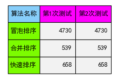

# 实验一 分治算法实验报告

## 学号：20201060283

## 实验目的：

1. 深入理解算法时间复杂度渐进性态和增长率的概念

2. 理解分治算法设计的基本
思想

3. 理解递归程序实现的基本方法

4. 加深对分治算法设计与分析思想的理解

## 实验原理

1. 随机数生成算法（线性同余法）

2. 分治算法
   1. 分解
   2. 求解
   3. 合并

3. 测试用算法
   1. 冒泡排序
   2. 合并排序
   3. 快速排序

## 实验输入数据集

[线性同余法](02_lcg.c)生成的随机数

## 实验内容

1. [线性同余法](02_lcg.c)
2. [排序算法](03_sort.c)
3. [测试函数](04_main.c)
3. [对比次数表格](05_plot_cmp.py)
4. [对比曲线图](06_plot_line_chart.py)
5. [子问题规模表](07_plot_scale_chart.py)

## 实验过程

```bash
cd .\ex1\

gcc .\04_main.c -o .\04_main.exe

.\04_main.exe

python .\05_plot_cmp.py

python .\06_plot_line_chart.py

python .\07_plot_scale_chart.py

cd ..
```

## 实验结果
- 比较操作对比图

  
- 冒泡排序曲线图
  
  
- 合并排序曲线图
  
- 快速排序曲线图
  
- 三者比较曲线图
  
- 子问题规模表
  

## 实验总结
通过比较很明显，冒泡排序的算法时间复杂度为O(n^2)

而归并排序和快速排序的算法时间复杂度曲线也符合O(nlogn)的形状

同时可以看出合并排序是每一次都进行精确二分的操作，而快速排序则较为随机
